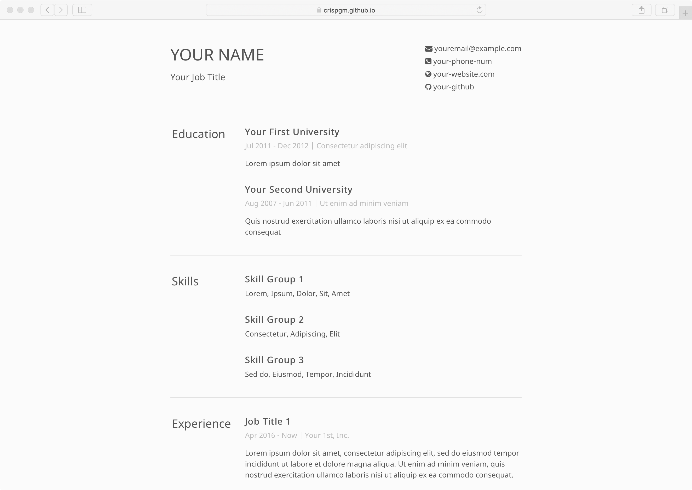
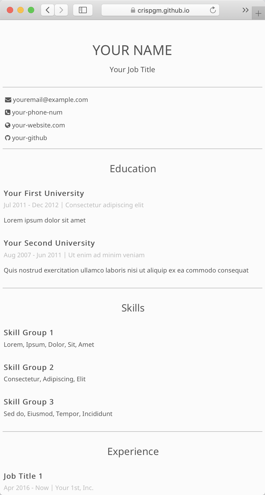

# Crisp Minimal Résumé


<p align="center">
  
  
</p>

## Introduction

[English](/README.md) [简体中文](/README_zh-CN.md)

This is a responsive minimal résumé template made by Crisp, powered by [Jekyll](http://jekyllrb.com/).

You may config all the data in `yaml` and make it your own résumé. Then, you might use on GitHub Pages, your website, or wherever you want.

[DEMO](https://crispgm.github.io/resume/resume.html)

## Features

* Simple, elegant, and minimal design
* PC and mobile friendly, but it looks better on PC
* PDF supports and print friendly
* Flexible and extensible

## Usage

1. Clone the repo

    ```shell
    git clone https://github.com/crispgm/resume.git
    ```

2. Install Jekyll

    ```shell
    gem install jekyll
    ```

3. Config your résumé data

    The `baseurl` is required in `_config.yml` if you serve this page as part of your website. And your contact information, __EDUCATION__, __SKILLS__, __EXPERIENCE__, and __PROJECTS__ data will be set in `_data/resume.yml`.

4. Run and Debug

    ```shell
    jekyll serve
    ```

5. Build

    ```shell
    jekyll build
    ```

## Gem-based Theme

Gem-based version is coming soon.

## Data Format

### Contact

```yaml
contact:
  - icon: fa-envelope
    text: youremail@example.com
  - icon: fa-phone-square
    text: your-phone-num
  - icon: fa-globe
    text: your-website.com
    link: https://crispgm.github.io/resume/resume.html
```

FontAwesome iconfont is embedded, so use the `fa-` class name as icon. `link` is optional, present if you want a link for your web version.

## Extending Sections

1. Add new section in `_data/resume.yml`

  ```yaml
  languages:
    - name: English
      proficiency: Professional working proficiency
    - name: Mandarin Chinese
      proficiency: Native or bilingual proficiency
  ```

2. Add section to `resume.html`:

  ```html
  <section id="languages">
    <div class="section-title">
      Language
    </div>
    <div class="section-content">
      
      <div class="block">
        <div class="block-title">
          {{ lang.name }}
        </div>
        <div class="block-content">
          {{ lang.proficiency }}
        </div>
      </div>
      
    </div>
  </section>
  ```

## Showcases

Feel free to add yours here.

* [David Zhang](https://crispgm.com/resume/)

## License

[](/LICENSE)
